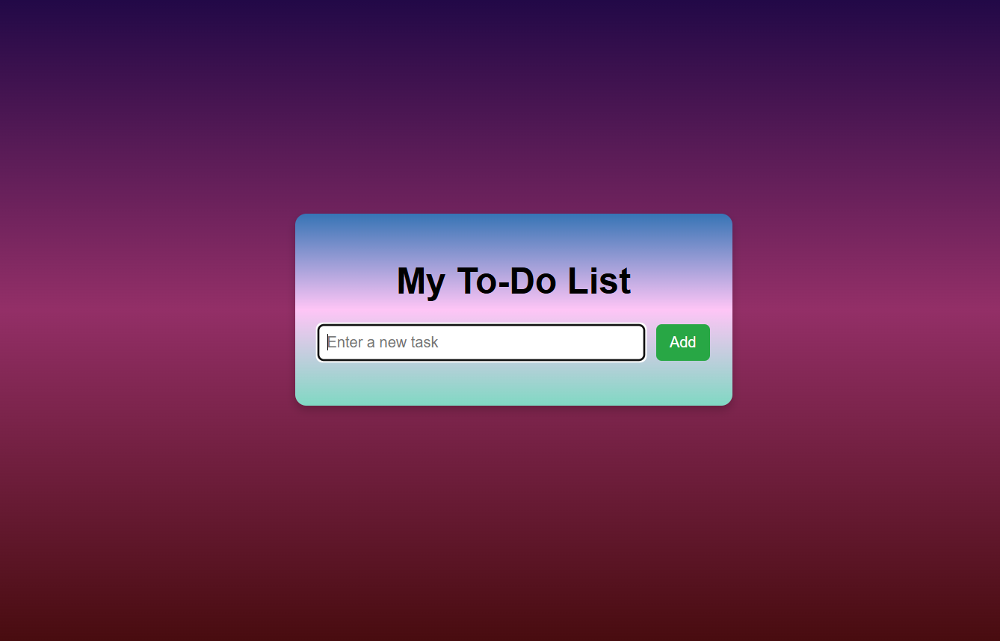
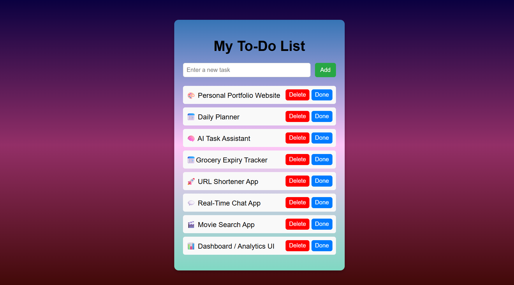
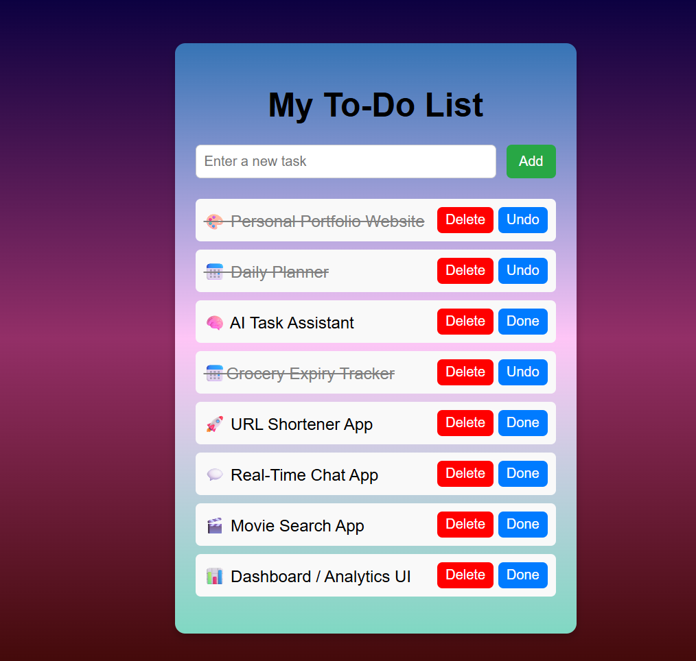

<<<<<<< HEAD
<h1 align="center">✅ Taskify – To-Do List App</h1>

<p align="center">
A simple and elegant <b>To-Do List Application</b> built using <b>HTML, CSS, and JavaScript</b>.  
It helps users <b>add, manage, complete, and delete tasks</b> with a clean and responsive UI.
</p>

<p align="center">
  
</p>

---

## ✨ Features
- ➕ Add new tasks  
- ✅ Mark tasks as complete  
- ❌ Delete individual tasks  
- 🗑️ Clear completed tasks  
- 💾 Data saved in localStorage  
- 📱 Fully responsive design  

---

## 🖼️ Screenshots

### 🏠 Home Page


### ➕ Add Task


### ✅ Completed Tasks


### ❌ Delete Task


---

## 🧠 Tech Stack
- **HTML5** – Structure and layout  
- **CSS3** – Styling and responsive design  
- **JavaScript (ES6)** – Logic and interactivity  
- **LocalStorage API** – Persistent data storage  

---

💡 Future Enhancements

🔔 Add task reminders or deadlines

🏷️ Add categories and filters

☁️ Sync tasks to a database

🎨 Add dark/light theme toggle

✨ Author

Deepika Lakshmi S
📧 Web Development Enthusiast

<p align="center"> Made with ❤️ using HTML, CSS, and JS </p> ```
=======
# taskify
A lightweight task manager web app that saves tasks locally in your browser.
>>>>>>> b77887b86b0a83702ec21775f27934bb05613e19
